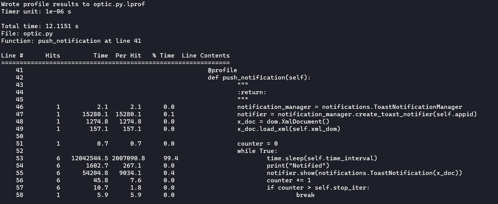
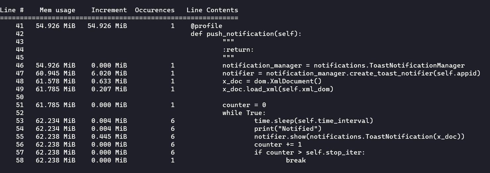

# OpticRescue
Save your precious eyes from strain


### Application User Model ID
[Official Docs](https://docs.microsoft.com/en-us/windows/configuration/find-the-application-user-model-id-of-an-installed-app)
```
#finding all AUMIDs
#open powershell as Admin
get-StartApps

#get specific program's APPID
get-StartApps <App Name>
#ex.
get-StartApps python
```

## Profiling
### Time Profiling


### Memory Profiling


### Queries
```
# time profiling
kernprof -l -v optic.py --interval 2 --stop_iterations 5
# memory profiling
python -m memory_profiler optic.py --interval 2 --stop_iterations 5
# generate time vs memory
mprof run optic.py --interval 2 --stop_iterations 5
mprof plot
```

## Support
#### Windows
```
Edition	        Windows 10 Home Single Language
Version	        20H2
OS build        19042.1110
```
